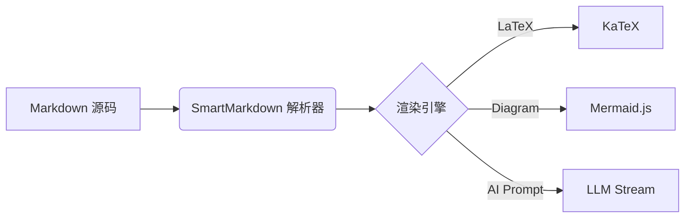

# SmartMarkdown 🚀

> 具备 AI 辅助写作、LaTeX 数学公式与 Mermaid 图表实时渲染的智能 Markdown 编辑器。

[](https://opensource.org/licenses/MIT)
[](#)
[](https://github.com/soda-code/SmartMarkdown/pulls)

**SmartMarkdown** 是一款面向科技作者、学术研究人员及开发者的下一代 Markdown 编辑器。它结合了现代生成式 AI 技术与强大的文档排版引擎，将复杂的公式计算、可视化图表绘制与智能创作无缝集成于一体。

---

## ✨ 核心特性

- **🤖 智能 AI 辅助写作**
  - **流式续写与补全**：基于上下文智能预测并生成后续内容。
  - **划词编辑与润色**：支持选中文本一键润色、语法纠错、长文缩写与扩写。
  - **多模型支持**：无缝对接 OpenAI (GPT-4o)、Anthropic (Claude 3.5)、Ollama (本地大模型) 及 DeepSeek 等。
- **📐 完整 LaTeX 数学公式**
  - 基于 **KaTeX** 高性能渲染引擎，毫秒级响应。
  - 支持行内公式（`$E=mc^2$`）与块级公式（`$$...$$`）。
  - 内置常用数学符号与矩阵快捷输入。
- **📊 文本化 Mermaid 图表**
  - 支持流程图（Flowchart）、时序图（Sequence Diagram）、甘特图（Gantt）、思维导图（Mindmap）等。
  - 代码变动实时预览，支持导出为高清晰度 SVG / PNG。
- **⚡ 高效编辑体验**
  - 基于 CodeMirror 6，提供极致流畅的打字体验与语法高亮。
  - 双栏同步滚动与“所見即所得”混合模式。
  - 全键盘快捷键支持、Vim 模式切按。
- **🔒 隐私优先与导出**
  - 本地优先（Local-First）架构，数据全盘掌控。
  - 支持导出为 HTML、PDF、Word (.docx) 及带格式的图像。

---

## 🛠️ 技术栈

* **前端框架**：[React 18](https://react.dev/) / [Next.js](https://nextjs.org/) + [Tailwind CSS](https://tailwindcss.com/)
* **编辑器底座**：[CodeMirror 6](https://codemirror.net/)
* **Markdown 解析**：[remark](https://github.com/remarkjs/remark) / [rehype](https://github.com/rehypejs/rehype)
* **数学渲染**：[KaTeX](https://katex.org/)
* **图表引擎**：[Mermaid.js](https://mermaid.js.org/)
* **状态管理**：[Zustand](https://github.com/pmndrs/zustand)

---

## 🚀 快速开始

### 前置要求

* [Node.js](https://nodejs.org/) >= 18.0.0
* pnpm / npm / yarn

### 安装步骤

1. **克隆项目仓库**
   ```bash
   git clone https://github.com/soda-code/SmartMarkdown.git
   cd SmartMarkdown
   ```

2. **安装依赖**
   ```bash
   pnpm install
   # 或
   npm install
   ```

3. **配置环境变量**
   复制 `.env.example` 并重命名为 `.env.local`，填写你的 AI API Key：
   ```bash
   cp .env.example .env.local
   ```
   在 `.env.local` 中配置对应的服务密钥：
   ```env
   # API 配置示例
   NEXT_PUBLIC_AI_PROVIDER=openai
   OPENAI_API_KEY=your_openai_api_key_here
   # 如使用本地 Ollama
   OLLAMA_BASE_URL=http://localhost:11434
   ```

4. **启动开发服务器**
   ```bash
   pnpm dev
   # 或
   npm run dev
   ```

   在浏览器中打开 `http://localhost:3000` 即可开始使用。

---

## 📖 使用指南

### 1. 撰写 LaTeX 公式

* **行内公式**：使用单个 `$` 包裹，例如 `$f(x) = ax + b$`
* **块级公式**：使用 `$$` 包裹：
  ```latex
  $$
  \frac{\partial \rho}{\partial t} + \nabla \cdot (\rho \mathbf{u}) = 0
  $$
  ```

### 2. 绘制 Mermaid 图表

使用 ````mermaid` 代码块包裹语法：

````markdown

````

### 3. AI 交互

* **唤起 AI 助手**：按 `Cmd + K` (Mac) 或 `Ctrl + K` (Windows) 打开 AI 提示词输入框。
* **快捷选中文本**：选中编辑区文本，在浮动菜单中选择 **“润色”**、**“翻译”** 或 **“生成摘要”**。

---

## 🤝 贡献指南

我们非常欢迎社区的贡献！如果你有任何想法、Bug 反馈或功能建议：

1. Fork 本仓库
2. 创建你的特性分支 (`git checkout -b feature/AmazingFeature`)
3. 提交你的修改 (`git commit -m 'Add some AmazingFeature'`)
4. 推送到分支 (`git push origin feature/AmazingFeature`)
5. 提交 Pull Request

---

## 📄 开源协议

本项目基于 [MIT 协议](LICENSE) 开源。
